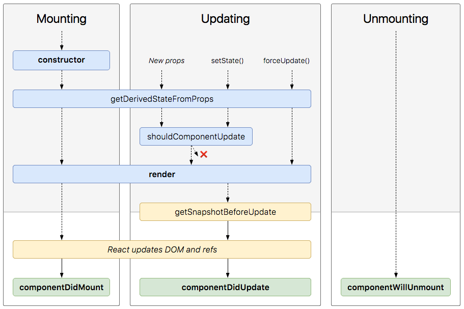

# Components and Props

**Component**를 사용하면 UI를 독립적이고 재사용 가능한 조각으로 분할하고 각 조각을 분리하여 생각할 수 있습니다.  

개념적으로 컴포넌트는 JavaScript 함수와 같습니다.  
그들은 임의의 입력(props)을 받아들이고 화면에 표시가 될 React elements를 반환합니다.  

**Component** 이름은 항상 **대문자**로 생성해야됩니다.  
React는 소문자로 시작하는 구성 요소를 DOM 태그로 처리합니다.  
예를 들어, `<div/>`는 HTML div 태그를 나타내지 만 `<Welcome/>`은 Component를 나타냅니다.  

컴포넌트는 크게 3가지로 나눌 수 있습니다.  

- **Component**
- **Pure Component**
- **Stateless Functional Component**

각각의 차이점을 알아봅시다.  

## **Component**

**1. lifecycle method를 사용할 수 있습니다.**  
     
   프로세스의 특정 시간에 코드를 실행할 수 있는 여러 [lifecycle method](https://reactjs.org/docs/react-component.html#the-component-lifecycle)들을 사용할 수 있습니다.  
   lifecycle method 중 **shouldComponentUpdate**를 사용하면 조건에 따라서 렌더링을 하지 않을 수 있어서 성능 최적화를 할 수 있습니다.  

**2. 확장(extend)이 가능합니다.**  
   class이므로 필요에 따라서 다른 클래스로 확장(extend)해서 사용이 가능합니다.  

**3. Refs를 사용할 수 있습니다.**  
  ```jsx
  class MyComponent extends React.Component {
    constructor(props) {
      super(props);
      this.myRef = React.createRef();
    }
    render() {
      return <div ref={this.myRef} />;
    }
  }
  ```
   실제 DOM에 접근할 수 있는 [Refs](https://reactjs.org/docs/refs-and-the-dom.html)를 사용할 수 있습니다.  

## **Pure Component**
   ```jsx
    // Pure Component
    class HelloWorld extends React.PureComponent {
      render() {
        const { name } = this.props;
        return (
          <div>{`Hi ${name}`}</div>
        )
      }
    }
   ``` 
`shouldComponentUpdate` 메서드를 호출하지 않아도 *state*와 *props*가 다른지 자동으로 비교해서 다를 때에만 재 렌더링을 실행하기 때문에 성능 최적화에 도움이 됩니다.  

## **Stateless Functional Component**

**1. 클래스가 필요하지 않습니다.**  
   extends나 constructor을 사용하면서 좋지 않은 결과를 낳을 가능성이 없습니다.  

**2. this가 없습니다.**  
   stateless component는 그저 순수한 함수입니다.  
   따라서 짜증 나고 혼란스러운 단점들을 모두 피할 수 있습니다.  
   this가 없기 때문에 전체 구성요소를 이해하기가 더 쉬워집니다.  
   콘텍스트를 전달하기 위한 bind도 할 필요가 없습니다.  

**3. 모범적인 코드를 작성할 수 있습니다.**  
   state나 lifecycle method를 다루지 않기 때문에 state나 lifecycle method에서 발생하는 부수효과에 대한 영향이 없습니다.

**4. 코드가 간결해집니다.**  
   ```jsx
    // Component
    class HelloWorld extends React.Component {
      render() {
        const { name } = this.props;
        return (
          <div>{`Hi ${name}`}</div>
        )
      }
    }
   ```  
   ```jsx
    // Stateless Functional Component
    const HelloWorld = ({ name }) => (
      <div>{`Hi ${name}`}</div>
    );
   ```  
   함수형 컴포넌트는 위 예시와 같이 코딩 양이 줄어들고 코드를 더 간결하게 작성할 수 있습니다.  

**5. 이해하기가 쉽습니다.**  
   위에서 보듯 Stateless Functional Component는 props를 통해 내용을 채우고 HTML을 뱉어주는 함수입니다.  
   render method 내부에 많은 마크업과 여러개의 함수가 포함되어 있더라도 단순한 순수 함수라서 알아보기가 쉽습니다.  

**6. 테스트하기가 쉽습니다.**  
   순수한 함수이기 때문에 매우 직관적입니다.  
   위 4번 예시를 보면 props로 넘겨진 값으로 마크업 된 결과를 리턴해 준다는 것을 알 수 있습니다.  
   render 함수가 props.name으로 **'Kakao'** 를 받았을 경우에 **'\<div>Hi Kakao\</div>'** 를 리턴해 준다는 것을 증명해주죠.   
   state를 조작하거나 별도의 트릭을 사용하거나 특별한 라이브러리를 사용할 필요가 없어서 각각의 component들을 쉽게 테스트할 수 있습니다.  

**7. 성능이 좋아집니다.**  
   state나 lifecycle method에 따른 계산이 없기 때문에 불필요한 메모리를 사용하지 않기 때문에 성능이 좋아집니다.  

컴포넌트의 성격에 따라서 복잡한 로직이 들어가고 반복되는 렌더링을 최적화 해야 된다면 기본 `Component`를 사용하고 특별한 기능이 필요 없는 간단한 컴포넌트가 필요하다면 `Stateless Functional Component`를 선택해서 사용하면 됩니다.  

## React.Component

React의 Component 함수 내부는 다음과 같은 형태로 구성되어있습니다.

```js
function Component() {};
Component.prototype.isReactComponent = {};
Component.prototype.setState = function (partialState, callback) {};
Component.prototype.forceUpdate = function (callback) {};
```

이제 하나씩 살펴봅시다.  

```js
function Component(props, context, updater) {
  this.props = props;
  this.context = context;

  // Component에 문자열 참조가 있는 경우 나중에 다른 객체를 할당합니다.
  this.refs = emptyObject;

  // 기본적으로 React에 있는 ReactNoopUpdateQueue를 사용하지만
  // 실제로 실행될 때에는 ReactDOM에서 Component의 updater를 ReactDOM에 있는 함수로 변경하므로
  // ReactDOM에 있는 classComponentUpdater 객체를 사용하게 됩니다.
  // ReactNoopUpdateQueue 객체와 메서드가 동일합니다.
  this.updater = updater || ReactNoopUpdateQueue;
}
```

`emptyObject` 객체

```js
// 빈 객체에 freeze해서 아무것도 추가 못하게 만듭니다.
var emptyObject = {};
{
  Object.freeze(emptyObject);
}
```

```js
// ReactDOM에서 기본 React Component인지 확인할 때 사용하는데
// Component.prototype.isReactComponent의 타입이 'object'인지 확인합니다.
Component.prototype.isReactComponent = {};
```

```js
/**
 * 상태를 변경하려면 항상 이 항목을 사용합니다.
 * `this.state`는 불변의 객체로 생각하고 직접 접근해서 사용하면 절대 안됩니다.
 *
 * `this.state`가 즉시 업데이트 될 것이라는 보장은 없으므로
 * 이 방법을 호출한 후 `this.state`에 액세스하면 이전 값이 반환 될 수도 있습니다.
 *
 * `setState`에 대한 호출은 함께 일괄 처리 될 수 있으므로, 동기식으로 실행된다는 보장은 없습니다.
 * `setState`에 대한 호출이 실제로 완료 됐을 때 선택적으로 콜백을 사용할 수 있습니다.
 *
 * `setState`를 호출하면 비동기적으로 나중에 실행됩니다.
 * React의 lifecycle 때문에 render 함수에 도달하기 전에 거치는 함수들을 통과해야지만 최종적으로
 * 새로운 state, props, 그리고 context가 할당됩니다.
 *
 * 변경될 state나 function을 사용하여 현재 상태와 병합해서 다음 상태를 생성합니다.
 * @param {object|function} partialState
 * state가 갱신된 후 호출될 콜백
 * @param {?function} callback
 * @final
 * @protected
 */
Component.prototype.setState = function (partialState, callback) {
  // partialState 매개변수 타입이 object나 function이나 비어있는 값이 아니면 에러 내보냄
  // invariant은 에러 생성해서 내보내는 함수
  !(typeof partialState === 'object' || typeof partialState === 'function' || partialState == null) ? invariant(false, 'setState(...): takes an object of state variables to update or a function which returns an object of state variables.') : void 0;

  // setState를 업데이터 대기열에 넣습니다.
  this.updater.enqueueSetState(this, partialState, callback, 'setState');
};
```

Component.prototype.setState 내부의 `this.updater.enqueueSetState`  
(ReactDOM의 classComponentUpdater.enqueueSetState)  

```js
var classComponentUpdater = {
  isMounted: isMounted,
  // ( inst => 컴포넌트의 instance, payload: 업데이트 될 데이터, callback: 콜백함수 )
  enqueueSetState: function (inst, payload, callback) {
    // 해당 인스턴스의 FiberNode
    var fiber = get(inst);

    // 따라가보면 Performance.now()로 앱 최초 실행 후 현재까지의 시간 체크... ex) 2841
    var currentTime = requestCurrentTime();

    // FiberNode 만료 시간 계산... ex) 1
    // computeExpirationForFiber 함수 내용이 많아서 일단 패스..
    var expirationTime = computeExpirationForFiber(currentTime, fiber);

    // 업데이트 객체 설정 ( 아래 코드 참고 )
    var update = createUpdate(expirationTime);

    // 업데이트 객체에 업데이트 할 데이터 등록
    update.payload = payload;

    // 콜백함수가 있으면
    if (callback !== undefined && callback !== null) {
      {
        // 콜백 타입이 함수가 맞는지 체크하고 아니면 에러 내보냄
        warnOnInvalidCallback$1(callback, 'setState');
      }
      // 업데이트 객체에 콜백 등록
      update.callback = callback;
    }

    // 업데이트 대기열 함수에 fiberNode와 update 함수를 넣습니다.
    enqueueUpdate(fiber, update);


    scheduleWork(fiber, expirationTime);
  },
  enqueueReplaceState: function (inst, payload, callback) {
    (...)
  },
  enqueueForceUpdate: function (inst, callback) {
    (...)
  }
};
```

classComponentUpdater 내부의 `get`

```js
function get(key) {
  // _reactInternalFiber: FiberNode
  return key._reactInternalFiber;
}
```

classComponentUpdater 내부의 `createUpdate`

```js
var UpdateState = 0;

function createUpdate(expirationTime) {
  return {
    expirationTime: expirationTime,

    tag: UpdateState,
    payload: null,
    callback: null,

    next: null,
    nextEffect: null
  };
}
```

classComponentUpdater 내부의 `warnOnInvalidCallback$1` 함수

```js
warnOnInvalidCallback$1 = function (callback, callerName) {
    // 콜백이 없거나 타입이 함수면 리턴
    if (callback === null || typeof callback === 'function') {
      return;
    }

    // 키 이름 생성해서
    var key = callerName + '_' + callback;

    // 기존에 문제가 있어서 저장해놓은 콜백 이름이 아니면
    if (!didWarnOnInvalidCallback.has(key)) {

      // 문제있는 콜백 키를 Set 객체에 새로 추가하고
      didWarnOnInvalidCallback.add(key);

      // 콜백은 함수 형태로 넘겨달라고 사용자한테 에러 내보냄
      warningWithoutStack$1(false, '%s(...): Expected the last optional `callback` argument to be a ' + 'function. Instead received: %s.', callerName, callback);
    }
  };
```

classComponentUpdater 내부의 `enqueueUpdate` 함수  
[TODO] fiber.updateQueue와 alternate.updateQueue 어떤 관계인지 알아내야됨..

```js
function enqueueUpdate(fiber, update) {
  // 업데이트 대기열이 지연돼서 생성됩니다.

  // 번갈아가면서 뭘 하는건가???
  // alternate 값은 잘 모르겠다
  var alternate = fiber.alternate;

  // 큐1 변수
  var queue1 = void 0;

  // 큐2 변수
  var queue2 = void 0;

  // alternate가 null이면
  if (alternate === null) {

    // 큐1 변수에 fiberNode의 updateQueue로 지정
    queue1 = fiber.updateQueue;

    // 큐2 변수는 null
    queue2 = null;

    // 큐1 변수 값이 없으면
    if (queue1 === null) {

      // fiber.updateQueue에 createUpdateQueue로 업데이트 큐를 새롭게 생성
      queue1 = fiber.updateQueue = createUpdateQueue(fiber.memoizedState);
    }
  } else {
    // alternate 값이 있으면 큐1 변수에 fiberNode의 updateQueue 값을 넣고
    queue1 = fiber.updateQueue;

    // 큐2 변수에는 alternate의 updateQueue 값을 넣는다
    queue2 = alternate.updateQueue;

    if (queue1 === null) {
      if (queue2 === null) {
        // fiberNode와 alternate 모두 updateQueue가 없으면 ( 어느 상황이지? )
        // 큐1 변수와 fiber.updateQueue에 새롭게 업데이트 큐를 생성
        queue1 = fiber.updateQueue = createUpdateQueue(fiber.memoizedState);
        // 큐2 변수와 alternate.updateQueue에 새롭게 업데이트 큐를 생성
        queue2 = alternate.updateQueue = createUpdateQueue(alternate.memoizedState);
      } else {
        // alternate.updateQueue만 있으면 큐1 변수와 fiber.updateQueue에 alternate.updateQueue를 복사함
        queue1 = fiber.updateQueue = cloneUpdateQueue(queue2);
      }
    } else {
      if (queue2 === null) {
        // fiber.updateQueue만 있으면 큐2 변수와 alternate.updateQueue에 fiber.updateQueue를 복사함
        queue2 = alternate.updateQueue = cloneUpdateQueue(queue1);
      } else {
        // fiber.updateQueue와 alternate.updateQueue 모두 업데이트 큐가 존재하는 경우
      }
    }
  }

  // 큐2 변수(alternate.updateQueue)가 없거나 첫번재 큐와 두번째 큐가 같으면
  if (queue2 === null || queue1 === queue2) {
    // 큐1 변수(fiber.updateQueue)에 업데이트 될 데이터를 넣는다
    // fiber.updateQueue의 firstUpdate 메서드와 lastUpdate 메서드가 채워진다
    appendUpdateToQueue(queue1, update);
  } else {
    // 대기열이 두 개 있습니다. 목록의 지속적 구조를 고려하면서 두 대기열에 업데이트를 추가해야합니다.
    // 동일한 업데이트가 여러 번 추가되는 것을 원하지 않습니다.
    if (queue1.lastUpdate === null || queue2.lastUpdate === null) {
      // fiber나 alternate 둘 중 하나라도 마지막 업데이트 값이 없으면
      // 둘 모두에게 업데이트 될 값을 넣습니다.
      appendUpdateToQueue(queue1, update);
      appendUpdateToQueue(queue2, update);
    } else {
      // fiber나 alternate 둘 다 비어있으면 구조적 공유 때문에 둘의 마지막 업데이트는 동일합니다.
      // 따라서 fiber.updateQueue에만 업데이트 될 값을 넣습니다.
      appendUpdateToQueue(queue1, update);
      // 그러나 queue2 변수(alternate.updateQueue)의 `lastUpdate` 메서드에는 업데이트 될 값을 넣어줘야됩니다.
      queue2.lastUpdate = update;
    }
  }

  {
    if ((fiber.tag === ClassComponent || fiber.tag === ClassComponentLazy) && (currentlyProcessingQueue === queue1 || queue2 !== null && currentlyProcessingQueue === queue2) && !didWarnUpdateInsideUpdate) {
      warningWithoutStack$1(false, 'An update (setState, replaceState, or forceUpdate) was scheduled ' + 'from inside an update function. Update functions should be pure, ' + 'with zero side-effects. Consider using componentDidUpdate or a ' + 'callback.');
      didWarnUpdateInsideUpdate = true;
    }
  }
}
```

enqueueUpdate 내부의 `createUpdateQueue`

```js
function createUpdateQueue(baseState) {
  var queue = {
    baseState: baseState,
    firstUpdate: null,
    lastUpdate: null,
    firstCapturedUpdate: null,
    lastCapturedUpdate: null,
    firstEffect: null,
    lastEffect: null,
    firstCapturedEffect: null,
    lastCapturedEffect: null
  };
  return queue;
}
```

enqueueUpdate 내부의 `cloneUpdateQueue`

```js
function cloneUpdateQueue(currentQueue) {
  var queue = {
    baseState: currentQueue.baseState,
    firstUpdate: currentQueue.firstUpdate,
    lastUpdate: currentQueue.lastUpdate,

    // TODO: With resuming, if we bail out and resuse the child tree, we should
    // keep these effects.
    firstCapturedUpdate: null,
    lastCapturedUpdate: null,

    firstEffect: null,
    lastEffect: null,

    firstCapturedEffect: null,
    lastCapturedEffect: null
  };
  return queue;
}
```

```js
/**
 * Forces an update. This should only be invoked when it is known with
 * certainty that we are **not** in a DOM transaction.
 *
 * You may want to call this when you know that some deeper aspect of the
 * component's state has changed but `setState` was not called.
 *
 * This will not invoke `shouldComponentUpdate`, but it will invoke
 * `componentWillUpdate` and `componentDidUpdate`.
 *
 * @param {?function} callback Called after update is complete.
 * @final
 * @protected
 */
Component.prototype.forceUpdate = function (callback) {
  this.updater.enqueueForceUpdate(this, callback, 'forceUpdate');
};
```
