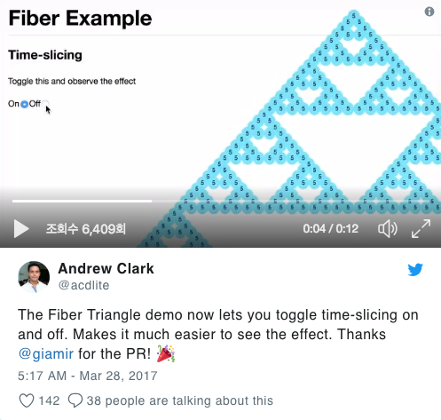
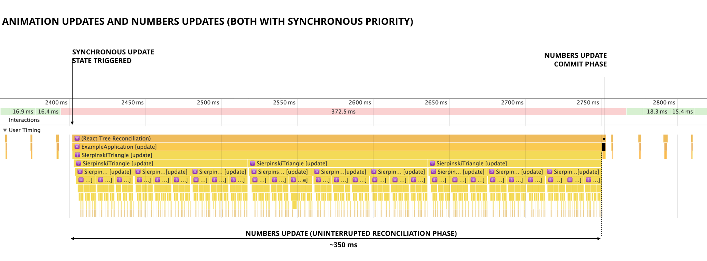

# React Fiber

**React Fiber**는 React reconciler(조정자)를 재 작성한 것입니다.  
React팀은 이 아키텍처를 구현하기 위해 2년 넘도록 연구를 진행해서 완성시켰습니다.  
React Fiber의 목표는 애니메이션, 레이아웃 및 제스처와 같은 영역에 대한 적합성을 높이는 것입니다.  
주요 기능은 **incremental rendering**(렌더링 작업을 청크로 분할하여 여러 프레임에 분산시키는 기능)입니다.  

React팀에서는 이 개념을 **Time Slicing**이라고 이름을 정했습니다.  

## reconciler를 왜 재 작성했는가?

아마도 주된 이유 중 하나는 우리가 브라우저에서 예전부터 겪어왔던 문제 때문입니다.  

**메인 스레드는 UI 스레드와 동일합니다.**  

페이지 렌더링, 사용자 액션에 대한 응답, JS 계산, 네트워크 활동 관리 및 DOM 조작은 모두 브라우저 메인 스레드에서 처리합니다.  
이러한 것들 중 일부는 워커를 사용하여 다른 스레드에서 처리할 수 있지만 **DOM은 메인 스레드에서만 처리할 수 있습니다**.  

React에서 state가 변경되거나 props가 업데이트되면 `render()`함수는 React Elements의 새 트리를 만들고 다음 React가 조정 알고리즘을 실행하여 UI를 효율적으로 업데이트해서 새 트리와 일치시키는 방법을 찾습니다.  

`React Stack` reconciler는 항상 단일 패스에서 컴포넌트 트리를 동기화하여 처리합니다.  
이렇게 하면 재귀 프로세스가 완료될 때까지 메인 스레드가 다른 긴급한 작업을 실행하지 못합니다.  
사용자가 텍스트를 입력하는 동안 실시간으로 계속 계산이 실행된다면 앱이 응답하지 않아 프레임 속도가 고르지 않고 입력이 느려질 수 있습니다.  

> 새로운 Fiber reconciler의 주요 목표는 중단 가능한 작업을 여러 유형의 업데이트에 우선순위를 할당해서 메인 스레드가 diff 알고리즘을 일시 중지하고 다른 더 긴급한 작업을 수행할 수 있도록 하고 나중에 중단한 곳에서 다시 계속 진행할 수 있도록 중단 가능한 작업을 청크로 나누는 것입니다. - [Giamir Blog - What is React Fiber](https://giamir.com/what-is-react-fiber)  

`Fiber`는 다음과 같은 기능을 사용할 수 있습니다.  

- **아직 화면에 표시되지 않은 로직이 있으면 나중에 처리되도록 지연시킬 수 있습니다.**  
  => 데이터가 프레임 속도보다 빠르게 처리되면 통합 및 배치 업데이트를 수행하는 데 있어서 유리합니다.
- **작업의 우선순위를 제어할 수 있습니다.**  
  => 프레임이 끊기지 않도록 덜 중요한 작업들(예: 네트워크에서 방금 로드한 새로운 콘텐츠를 렌더링)보다  
  사용자의 상호작용(예: 버튼 클릭으로 인한 애니메이션)에서 오는 작업의 우선순위를 더 높게 해서 먼저 처리하게 할 수 있습니다.  

## React Fiber의 알고리즘 단계

1. **render/reconciliation**
2. **commit**

첫번째로는 Fiber가 진행중인 작업 트리를 만들고 UI를 업데이트 하기 위해 필요한 변경 사항 목록을 파악하는 렌더/조정 단계가 있습니다.  
이 단계에서는 실제적인 변화를 일으키지는 않습니다.  

이 첫번째 단계에서는 각각의 컴포넌트들에게 변화가 있는지 없는지 검사하면서 현재 작업에 할당된 시간이 얼마나 남았는지, 그리고 다른 우선순위가 높은 작업이 없는지 지속적으로 검사합니다.  
만약 할당된 시간을 모두 소진하거나 다른 우선순위가 높은 작업이 들어왔을 때에는 현재 작업 상태를 저장하고 다른 작업에 프로세스를 양보합니다.  

그런 다음 두번째로 커밋 단계가 있으며 이 단계에서 모든 변경 사항들을 실제 DOM에 적용합니다.  
이 커밋 단계에서는 Fiber가 중간에 개입에서 중단하지 않으며 끝까지 진행됩니다.  

Fiber도 lifecycle hooks를 호출하고 커밋 단계의 일부 오류를 처리합니다.  

## 예제로 달라진 리액트 아키텍쳐의 퍼포먼스를 알아봅시다  

React Core팀의 기술 리더인 **Sebastian Markbåge**가 `React Fiber`의 이점을 잘 이해하기 위해 유용한 프랙탈 예제를 만들었습니다.  

  

[Fiber Example 동영상](https://twitter.com/twitter/statuses/846456239693344769)  

> Triangles Demo의 소스 코드는 [Official Github React Repository](https://github.com/facebook/react/blob/master/fixtures/fiber-triangle/index.html)에서 확인할 수 있습니다.  

### Time Slicing 전용 전
  

애니메이션과 숫자는 Time Slicing 없이 삼각형 데모에서 타임라인을 업데이트합니다.  

위의 그림에서 볼 수 있듯이 숫자 업데이트가 트리거 되면서 `Work-in-progress tree`를 구축하는 동안 `Fiber`는 해당 tree에서 변경 사항을 찾는 작업을 반복합니다.  
이렇게 하면 메인 스레드에서 `350ms`동안 일을 바쁘게 처리하는 게 유지됩니다.  

메인 스레드가 애니메이션 업데이트를 관리하지 못하도록 하면 프레임이 길어지고 결과적으로는 사용자는 부드럽지 못하고 부자연스럽게 움직이는 모션을 보게 됩니다.  

위 예제는 *Fiber의 호환 모드*에서 사용했기 때문에 Time Slicing이 적용되지 않아서 모든 업데이트는 우선순위가 지정되지 않고 **동기식**으로 처리되었습니다.  

### Time Slicing 적용 후
  

애니메이션과 숫자는 Time Slicing으로 Triangles Demo의 타임라인을 업데이트합니다.  

그림에서 볼 수 있듯이 숫자 업데이트가 트리거되면 React는 **requestIdleCallBack** 함수를 호출하고 새 트리의 변경 사항을 찾지 않습니다.  
숫자 업데이트는 이제 우선 순위가 낮은 것으로 간주되므로 연기됩니다.  

> [**requestIdleCallBack**](https://developer.mozilla.org/ko/docs/Web/API/Window/requestIdleCallback)은 브라우저의 전반적인 작업 일정에 협력할 수 있는 방법을 제공하는 한 방법입니다.

**requestIdleCallBack**을 사용한 공식 예제는 [Cooperative Scheduling of Background Tasks API
](https://developer.mozilla.org/ko/docs/Web/API/Background_Tasks_API)를 보시면 됩니다.  

[CodeSandbox에서 실행되는 예제](https://codesandbox.io/s/1vpk9zk6y4)  
위 예제를 크롬 개발자도구의 퍼포먼스 탭에서 체크해보면 requestIdleCallBack()을 적용했을 때 메인 스레드의 중간중간에 돔 렌더링 처리가 되고 있다는 것을 확인할 수 있습니다.  

Fiber에서는 requestIdleCallback을 활용해서 동작중인 React 코드를 매번 부르고, 주어진 시간을 초과한다면 멈추고 더 중요한 일에 양보합니다. 더 중요한 일이 끝나면 다시 돌아와서 나머지 작업을 완료합니다.

이 아이디어는 React 말고 다른 곳에도 적용될 수 있습니다. Reqct를 안 쓰는 환경에서도  복잡한 애니메이션 컨트롤을 해야 한다면 requestIdleCallback과 requestAnimationFrame을 잘 활용해서 최적의 성능을 낼 수 있을 것이라 생각합니다.  

이와 같은 동작은 DOM에 실제 변화를 주기 전 단계인 reconciliation(virtualDOM처리) 단계에서 처리된다고 합니다.  

stack을 컨트롤하기 위해 Fiber에서는 여러 가지 field 개념을 정의하고 있는데, stack frame을 구성하는데 필요한 부분인, function, return address, arguments등에 매칭 되는 것을 component, parent component, props 등으로 React의 구조에 맞게 이를 filed라고 정의해서 사용합니다. 작업의 우선순위를 결정하기 위한 priority 속성을 정의하기도 하고요. 이러한 것들로 *중단->양보->재개*를 원활하게 컨트롤할 것 같습니다.

이렇게 동작하는 Fiber의 실체는 JavaScript 객체 형태입니다. 다시 말해 위와 같이 동작되기 위해 그 정보를 객체에 담아두고 있는 것이고, 그걸 Fiber라고 일컫는 셈입니다.  

[참고]  
- [What is React Fiber ?](https://giamir.com/what-is-react-fiber)
- [남다른 개선방법을 다시 보여준 페이스북의 React Fiber](https://medium.com/@codesquad_yoda/%EB%82%A8%EB%8B%A4%EB%A5%B8-%EA%B0%9C%EC%84%A0%EB%B0%A9%EB%B2%95%EC%9D%84-%EB%8B%A4%EC%8B%9C-%EB%B3%B4%EC%97%AC%EC%A4%80-%ED%8E%98%EC%9D%B4%EC%8A%A4%EB%B6%81%EC%9D%98-react-fiber-80b7ca5bd9bb)
- [React Fiber](https://tech.wanted.co.kr/frontend/2018/01/07/react-fiber.html)
- [Functional setState is the future of React](https://medium.freecodecamp.org/functional-setstate-is-the-future-of-react-374f30401b6b)
- [setState 메서드 파라미터로 객체 대신 함수 사용하기](https://www.vobour.com/-setstate-%EB%A9%94%EC%8F%98%EB%93%9C-%ED%8C%8C%EB%9D%BC%EB%AF%B8%ED%84%B0%EB%A1%9C-%EA%B0%9D%EC%B2%B4-%EB%8C%80%EC%8B%A0-%ED%95%A8%EC%88%98-%EC%82%AC%EC%9A%A9%ED%95%98%EA%B8%B0-using)
