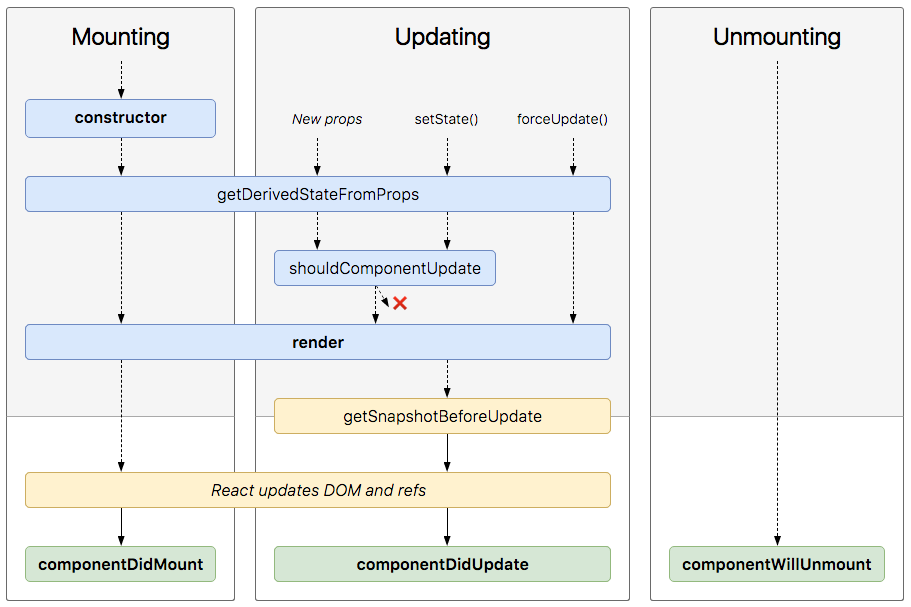
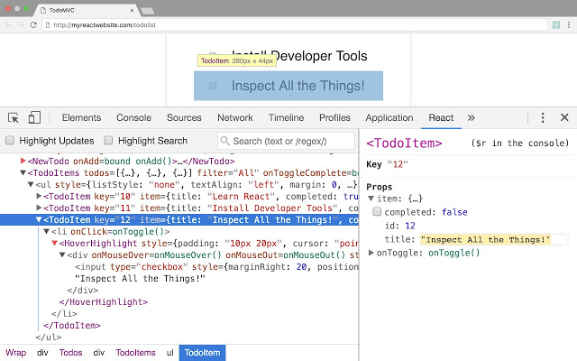
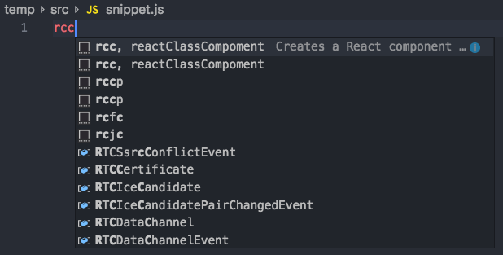
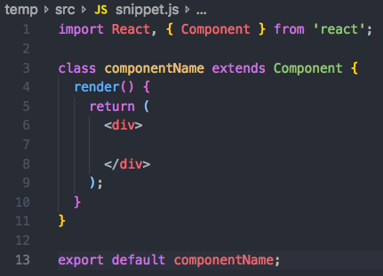

# 더 나은 리액트 코드 작성하기

리액트를 사용하는 데 있어서 더 나은 리액트 개발자가 될 수 있는 몇 가지 방법을 알려드립니다.  
이 방법을 통해서 리액트 기술 향상에 도움이 됐으면 좋겠습니다.

## Lint 적용하기

더 나은 코드를 작성하는데 있어서 정말 중요한 방법 중 하나는 린트를 적용하는 것입니다.  
좋은 규칙의 린트를 적용하면 코드 편집기가 코드에 문제가 발생할 수 있는 거의 모든 것을 잡아줄 수 있습니다.
그리고 린트 규칙에 적응하게되면 앞으로 모범적인 코드를 유지할 수 있게됩니다.  

```jsx
import React from 'react';

export default class App extends React.Component {
  render() {
    const { userIsLoaded, user } = this.props;
    if (!userIsLoaded) return <Loader />;
    return (
      <User>{children}</User>
    )
  }
}
```
위 코드에 린트를 적용하면  
`5:27 - 'user' is assigned a value but never used. (no-unused-vars)`  
`8:14 - 'children' is not defined. (no-undef)`  
이렇게 어느 부분이 잘못됐는지 알려줘서 올바른 코드를 작성하는데 도움을 줍니다.  

[ESLint](https://eslint.org)로 가서 JavaScript의 린팅 유틸리티를 설정하거나 [Airbnb의 JavaScript Style Guide](https://github.com/airbnb/javascript)를 사용할 수 있습니다.  
또한 [ESLint-plugin-React](https://github.com/yannickcr/eslint-plugin-react)를 사용해도 됩니다.


## propTypes랑 defaultProps 사용하기

컴포넌트에서 원하는 props의 type과 실제 props에서 전달된 type이 일치하는지를 확인하고 싶으면 **`propTypes`** 객체를 설정하면 됩니다.  
또한 이를 필수 값으로 설정할 수도 있습니다.

**부모 컴포넌트**
```jsx
// App.js
import React from "react";
import ReactDOM from "react-dom";
import Content from "./Content";

function App() {
  return (
    <div className="App">
      <Content title={1234}/>
    </div>
  );
}

const rootElement = document.getElementById("root");
ReactDOM.render(<App />, rootElement);
```

**자식 컴포넌트**
```jsx
// Content.js
import React from 'react';
import PropTypes from 'prop-types';

class Content extends React.Component {
  static propTypes = {
    title: PropTypes.string,
    body: PropTypes.string.isRequired
  }

  render() {
    const { title, body } = this.props;

    return (
      <div>
        <h2>{title}</h2>
        <p>{body}</p>
      </div>
    );
  }
}

export default Content;
```

자식 컴포넌트에서 propTypes로 title에는 문자열이 와야 된다고 설정해놨는데 부모에서 숫자를 넘겨줬으므로 아래와 같은 에러가 표시됩니다.  
`Warning: Failed prop type: Invalid prop 'title' of type 'number' supplied to 'Content', expected 'string'.`  

자식 컴포넌트에서 propTypes로 body에는 문자열이 오면서 필수 값이라고 설정해놨으므로 문자열이 아니거나 값이 없으면 아래와 같은 에러가 표시됩니다.  
`Warning: Failed prop type: The prop 'body' is marked as required in 'Content', but its value is 'undefined'.`  

**`propTypes`** 에 대한 자세한 내용을 확인하려면 [Typechecking With PropTypes](https://reactjs.org/docs/typechecking-with-proptypes.html) 페이지를 참고해주세요.  

그리고 때에 따라서 부모 props에서 값을 넘겨주지 않는 경우도 있는데 기본값을 넣어주고 싶으면 **`defaultProps`** 를 설정하면 됩니다.  

**자식 컴포넌트**
```jsx
// Content.js
import React from 'react';
import PropTypes from 'prop-types';

class Content extends React.Component {
  static propTypes = {
    title: PropTypes.string,
    body: PropTypes.string.isRequired
  }

  static defaultProps = {
    title: '제목입니다.',
    body: '내용입니다.'
  }

  render() {
    const { title, body } = this.props;

    return (
      <div>
        <h2>{title}</h2>
        <p>{body}</p>
      </div>
    );
  }
}

export default Content;
```

이렇게 **`defaultProps`** 값을 지정해놓으면 props가 빈 값으로 들어와도 설정해놓은 기본값이 적용됩니다.  


## 컴포넌트 분리하기

작성된 코드가 길어져서 새로운 컴포넌트로 분리해야되겠는데 어떤 부분을 분리하는게 좋을지 잘 모르겠으면 아래 세가지 질문에 답해보세요.  
- ***코드가 복잡해지고 기능을 다루기 어려운가?***  
- ***이 컴포넌트의 기능을 대표하는가?***  
- ***해당 코드가 반복 사용되는가?***  

이 질문 중 하나라도 해당되면 해당 코드를 별도 컴포넌트로 분리하는게 좋습니다.


## Component vs Pure Component vs Stateless Functional Component

### **Component**
**1. lifecycle method를 사용할 수 있습니다.**  
     
   프로세스의 특정 시간에 코드를 실행할 수 있는 여러 [lifecycle method](https://reactjs.org/docs/react-component.html#the-component-lifecycle)들을 사용할 수 있습니다.  
   lifecycle method 중 **shouldComponentUpdate**를 사용하면 조건에 따라서 렌더링을 하지 않을 수 있어서 성능 최적화를 할 수 있습니다.  

**2. 확장(extend)이 가능합니다.**  
   class이므로 필요에 따라서 다른 클래스로 확장(extend)해서 사용이 가능합니다.  

**3. Refs를 사용할 수 있습니다.**  
  ```jsx
  class MyComponent extends React.Component {
    constructor(props) {
      super(props);
      this.myRef = React.createRef();
    }
    render() {
      return <div ref={this.myRef} />;
    }
  }
  ```
   실제 DOM에 접근할 수 있는 [Refs](https://reactjs.org/docs/refs-and-the-dom.html)를 사용할 수 있습니다.  

### **Pure Component**
   ```jsx
    // Pure Component
    class HelloWorld extends React.PureComponent {
      render() {
        const { name } = this.props;
        return (
          <div>{`Hi ${name}`}</div>
        )
      }
    }
   ``` 
`shouldComponentUpdate` method를 실행하지 않아도 **Pure Conponent**가 *state*와 *props*가 다른지 자동으로 비교해서 다를 때에만 재 렌더링을 실행하기 때문에 성능 최적화에 도움이 됩니다.  

### **Stateless Functional Component**
**1. 클래스가 필요하지 않습니다.**  
   extends나 constructor을 사용하면서 좋지 않은 결과를 낳을 가능성이 없습니다.  

**2. this가 없습니다.**  
   stateless component는 그저 순수한 함수입니다.  
   따라서 짜증 나고 혼란스러운 단점들을 모두 피할 수 있습니다.  
   this가 없기 때문에 전체 구성요소를 이해하기가 더 쉬워집니다.  
   콘텍스트를 전달하기 위한 bind도 할 필요가 없습니다.  

**3. 모범적인 코드를 작성할 수 있습니다.**  
   state나 lifecycle method를 다루지 않기 때문에 state나 lifecycle method에서 발생하는 부수효과에 대한 영향이 없습니다.

**4. 코드가 간결해집니다.**  
   ```jsx
    // Component
    class HelloWorld extends React.Component {
      render() {
        const { name } = this.props;
        return (
          <div>{`Hi ${name}`}</div>
        )
      }
    }
   ```  
   ```jsx
    // Stateless Functional Component
    const HelloWorld = ({ name }) => (
      <div>{`Hi ${name}`}</div>
    );
   ```  
   함수형 컴포넌트는 위 예시와 같이 코딩 양이 줄어들고 코드를 더 간결하게 작성할 수 있습니다.  

**5. 이해하기가 쉽습니다.**  
   위에서 보듯 Stateless Functional Component는 props를 통해 내용을 채우고 HTML을 뱉어주는 함수입니다.  
   render method 내부에 많은 마크업과 여러개의 함수가 포함되어 있더라도 단순한 순수 함수라서 알아보기가 쉽습니다.  

**6. 테스트하기가 쉽습니다.**  
   순수한 함수이기 때문에 매우 직관적입니다.  
   위 4번 예시를 보면 props로 넘겨진 값으로 마크업 된 결과를 리턴해 준다는 것을 알 수 있습니다.  
   render 함수가 props.name으로 **'Kakao'** 를 받았을 경우에 **'\<div>Hi Kakao\</div>'** 를 리턴해 준다는 것을 증명해주죠.   
   state를 조작하거나 별도의 트릭을 사용하거나 특별한 라이브러리를 사용할 필요가 없어서 각각의 component들을 쉽게 테스트할 수 있습니다.  

**7. 성능이 좋아집니다.**  
   state나 lifecycle method에 따른 계산이 없기 때문에 불필요한 메모리를 사용하지 않기 때문에 성능이 좋아집니다.  

컴포넌트의 성격에 따라서 복잡한 로직이 들어가고 반복되는 렌더링을 최적화 해야 된다면 기본 `Component`를 사용하고 특별한 기능이 필요 없는 간단한 컴포넌트가 필요하다면 `Stateless Functional Component`를 선택해서 사용하면 됩니다.  


## React Dev Tools를 사용하기

  

전문적인 리액트 개발자가 되려면 **React Dev Tools**를 사용하는 것을 기본으로 생각해야 됩니다. 

**- React Dev Tools**는 [Chrome](https://chrome.google.com/webstore/detail/react-developer-tools/fmkadmapgofadopljbjfkapdkoienihi?hl=ko) 및 [Firefox](https://addons.mozilla.org/ko/firefox/addon/react-devtools/)와 같은 모든 주요 브라우저에서 사용할 수 있습니다.  
**- React Dev Tools**를 사용하면 **React**앱의 전체 구조에 접근할 수 있으며 앱에서 사용하는 모든 요소와 상태를 확인할 수 있습니다.  
**- React Dev Tools**는 **React** 구성 요소를 탐색하는 좋은 방법이며 앱의 모든 문제를 진단하는 데 큰 도움이 됩니다.  


## 인라인 조건문 사용하기
인라인 조건문을 사용하면 반응형 코드를 상당히 깔끔하게 만들 수 있습니다.
```jsx
<div className="user_info">
  {
    isLogin(user.id) &&
    <User userId={user.id} />
  }
</div>
```
**- 별도의 함수를 생성 안해도 됩니다.**  
**- 렌더 함수 안에 조건문을 추가할 필요가 없습니다.**  

위 코드에서 isLogin을 만족시키면 && 연산자 뒤에 있는 <User/> 컴포넌트가 생성됩니다.  
비교 조건문이 길지 않다면 인라인 코드를 사용하는 것도 좋은 방법입니다.

```jsx
let count = 0;
...
<div>
  {
    !!count && <User userId={user.id} />
  }
</div>
```
한 가지 주의할 점은 && 연산자 앞의 값이 0일 경우 0이 렌더링 되므로 !!(논리 부정 연산자)를 두 개 붙여서 꼭 Boolean 값으로 만들어야 됩니다.


## Snippet 라이브러리 사용하기

매번 같은 코드의 컴포넌트를 새로 만드는거는 귀찮은 작업입니다.  
코드를 복사해서 붙여넣는것도 한계가 있습니다.  
**Snippet** 라이브러리에 들어있는 자주 사용되는 코드 조각들을 사용하면 개발 생선성이 좋아집니다.  

 

 

위 스크린샷은 VSCode에서 [ES7 React/Redux/GraphQL/React-Native snippets](https://marketplace.visualstudio.com/items?itemName=dsznajder.es7-react-js-snippets) 확장 프로그램을 설치해서 사용한 모습입니다.

| Prefix    |	Method                                                                            |
|-----------|-----------------------------------------------------------------------------------|
| imr→      | import React from 'react'                                                         |
| imrd→     | import ReactDOM from 'react-dom'                                                  |
| imrc→	    | import React, { Component } from 'react'                                          |
| imrcp→    | import React, { Component } from 'react' & import PropTypes from 'prop-types'     |
| imrpc→    | import React, { PureComponent } from 'react'                                      |
| imrpcp→   | import React, { PureComponent } from 'react' & import PropTypes from 'prop-types' |
| impt→	    | import PropTypes from 'prop-types'                                                |
| redux→    | import { connect } from 'react-redux'                                             |
| rconst→	  | constructor(props) with this.state                                                |
| rconc→    | constructor(props, context) with this.state                                       |
| est→      |	this.state = { }                                                                  |
| cdm→	    | componentDidMount = () => { }                                                     |
| scu→	    | shouldComponentUpdate = (nextProps, nextState) => { }                             |
| cdup→	    | componentDidUpdate = (prevProps, prevState) => { }                                |
| cwun→	    | componentWillUnmount = () => { }                                                  |
| cwun→	    | componentWillUnmount = () => { }                                                  |
| gdsfp→	  | static getDerivedStateFromProps(nextProps, prevState) { }                         |
| gsbu→	    | getSnapshotBeforeUpdate = (prevProps, prevState) => { }                           |
| ren→      | render() { return( ) }                                                            |
| sst→      | this.setState({ })                                                                |
| ssf→	    | this.setState((state, props) => return { })                                       |
| props→    | this.props.propName                                                               |
| state→    | this.state.stateName                                                              |
| rcontext→	| const ${1:contextName} = React.createContext()                                    |
| cref→	    | this.${1:refName}Ref = React.createRef()                                          |
| fref→	    | const ref = React.createRef()                                                     |
| bnd→	    | this.methodName = this.methodName.bind(this)                                      |  


### 참고한 사이트 출처  
- [How To Write Better Code In React](https://blog.bitsrc.io/how-to-write-better-code-in-react-best-practices-b8ca87d462b0)  
- [React Stateless Functional Components: Nine Wins You Might Have Overlooked](https://hackernoon.com/react-stateless-functional-components-nine-wins-you-might-have-overlooked-997b0d933dbc) 
- [Stateless Component vs Pure Component](https://medium.com/groww-engineering/stateless-component-vs-pure-component-d2af88a1200b)  
