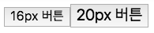
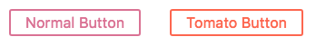
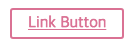
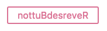
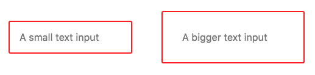
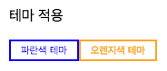

# Styled Components

요즘 인기있는 컴포넌트 스타일링 방식 중 하나인, JS 코드 내부에서 스타일을 정의하는 [styled-components](https://www.styled-components.com/)에 대해서 알아봅시다.  

## 설치 방법

npm으로 설치할 때에는 아래와 같이 설치합니다.

```sh
npm install --save styled-components
```

## 컴포넌트 스타일 적용

**styled-components**에 대해 이해해야 하는 가장 중요한 것은 그 이름을 문자 그대로 받아들여야 한다는 것입니다.  
더 이상 HTML Element를 스타일링하거나, class를 기반으로 컴포넌트를 스타일링하지 않습니다.  

```jsx
import styled from 'styled-components';

const Title = styled.h1`
  font-size: 1.7em;
  color: purple;
`;

render() {
  return (
    <Title>Kakao Mobility</Title>
  );
}
```

  

자신만의 캡슐화된 스타일의 **styled-components**를 정의한 후 자유롭게 코드 안에서 사용할 수 있습니다.  

> **styled-components** 공동 개발자인 Max Stoiber는 다음과 같이 말했습니다.  
> "스타일 구성 요소의 기본 아이디어는 스타일과 구성 요소 간의 매핑을 제거하여 모범 사례를 시행하는 것입니다."  

## class 대신 props

class를 사용하지 않는 철학을 유지하기 위해 **styled-components**는 compoent의 행동을 커스터마이징 할 때 props를 사용합니다.  

```jsx
const Title = styled.h1`
  font-size: 1.7em;
  color: ${props => props.primary ? 'blue' : 'purple'};
`;

render() {
  return (
    <Title primary>Kakao Mobility</Title>
  );
}
```

  

보다시피 **styled-components**를 사용하면 모든 CSS와 HTML을 소유함으로써 React 컴포넌트를 깨끗하게 정리해줍니다.  

그리고 이 코드는 아래처럼 변경해서 사용할 수도 있습니다.  

```jsx
const Title = styled.h1`
  font-size: 1.7em;
  color: purple;

  &.primary{
    color: blue;
  }
`;

render() {
  return (
    <Title className="primary">Kakao Mobility</Title>
  );
}
```

  

## defaultProps

**`defaultProps`** 를 사용해서 기본 props 값들을 설정할 수 있습니다.

```jsx
const Button = styled.button`
  font-size: ${props => props.fontSize};
`;

Button.defaultProps = {
  fontSize: "16px"
};

render() {
  return (
    <div>
      <Button>16px 버튼</Button>
      <Button fontSize="20px">20px 버튼</Button>
    </div>
  );
}
```

  

## 스타일 확장

컴포넌트의 일정 부분만 변경해서 사용할 때에는 styled-components의 **스타일 확장** 기능을 사용하면 쉽습니다.  

```jsx
// 기본 베이스의 버튼
const Button = styled.button`
  color: palevioletred;
  font-size: 1em;
  margin: 1em;
  padding: 0.25em 1em;
  border: 2px solid palevioletred;
  border-radius: 3px;
`;

// 기본 베이스 버튼 스타일에 색상과 테두리 색상만 변경
const TomatoButton = styled(Button)`
  color: tomato;
  border-color: tomato;
`;

render() {
  return (
    <div>
      <Button>Normal Button</Button>
      <TomatoButton>Tomato Button</TomatoButton>
    </div>
  );
}
```

  


## 동적 요소 변경

스타일은 그대로 유지하면서 요소만 변경하고싶다면 **`as`** 속성을 사용하여 변경하면 됩니다.  

Button 스타일은 그대로 사용하면서 **a 태그로 변경** 합니다.

```jsx
import Button from "./components/Button";

render() {
  return (
    <div>
      <Button as="a" href="/">Link Button</Button>
    </div>
  );
}
```

`<a href="/">Link Button</a>`  

  

Button 스타일은 그대로 사용하면서 **ReversedButton 함수 기능을 사용**합니다.

```jsx
import Button from "./components/Button";

const ReversedButton = props => <button {...props} children={props.children.split('').reverse()} />

render() {
  return (
    <div>
      <Button as={ReversedButton}>ReversedButton</Button>
    </div>
  );
}
```

  

## .attrs 생성자 사용

렌더링 된 component나 element에 불필요한 wrapper를 피하기 위해 **`.attrs`** 생성자를 사용하여 정적 props나 동적 props를 추가하거나 변경할 수 있습니다.

```jsx
const Input = styled.input.attrs({
  // 정적 props
  type: "password",
  // 동적 props
  margin: props => props.size || "1em",
  padding: props => props.size || "1em"
})`
  font-size: 1em;
  border: 2px solid red;
  border-radius: 3px;

  /* 위에서 지정한 margin, padding 이름의 props를 가져와서 사용할 수 있습니다. */
  margin: ${props => props.margin};
  padding: ${props => props.padding};
`;

render() {
  return (
    <div>
      <Input placeholder="A small text input" size="1em" />
      <Input placeholder="A bigger text input" size="2em" />
    </div>
  );
}
```

  

## Animation

@keyframes가 실제로 사용될 때에는 고유한 animation 이름으로 생성돼서 연결되기 때문에 앱 전체에서 고유하게 사용할 수 있습니다.

```jsx
import styled, { keyframes } from "styled-components";

const rotate360 = keyframes`
  from { transform: rotate(0deg) }
  to { transform: rotate(360deg) }
`;

const Rotate = styled.div`
  display: inline-block;
  animation: ${rotate360} 2s linear infinite;
  border: 3px solid orange;
`;

render() {
  return (
    <div>
      <Rotate>뱅글뱅글</Rotate>
    </div>
  );
}
```

다음과 같이 고유한 이름으로 애니메이션이 생성됩니다.

```css
.element {
  display: inline-block;
  animation: MQNGw 2s linear infinite
  border: 3px solid orange;
}
@keyframes MQNGw {
  0% { transform: rotate(0deg) }
  100% { transform: rotate(360deg) }
}
```

  

## 스타일 테마 지원

styled-components는 **`<ThemeProvider>`** wrapper component를 지원해서 테마 설정 기능을 제공합니다.  
해당 wrapper로 감싸져있는 하위 component에서 모두 사용이 가능합니다.  

```jsx
import styled, { ThemeProvider } from "styled-components";

const Button = styled.button`
  padding: 0.25em 1em;
  color: ${props => props.theme.color};
  border: 2px solid ${props => props.theme.color};
`;

const theme = {
  color: "blue"
};

/*
  ThemeProvider에 기본값을 지정하지 않으면 에러가 발생하므로 기본값을 넣어줘야 됩니다.
  (defaultProps로 기본값을 설정할 수 없습니다.)
*/
render() {
  return (
    <div>
      <p>테마 적용</p>
      <ThemeProvider theme={theme}>
        <div>
          <Button>파란색 테마</Button>
          <Button theme={{ color: "orange" }}>오렌지색 테마</Button>
        </div>
      </ThemeProvider>
    </div>
  );
}
```

  

## 참고 사이트

- [**styled-components**](https://www.styled-components.com/)  
- [**A 5-minute Intro to Styled Components**](https://medium.freecodecamp.org/a-5-minute-intro-to-styled-components-41f40eb7cd55)  
